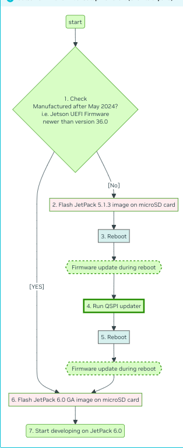
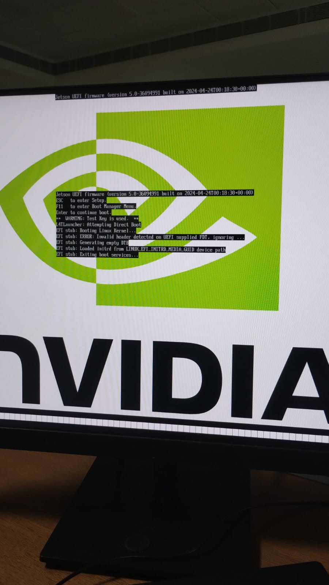

# Jetson Orin Nano Setup Guide

This document provides a step-by-step guide for setting up the Jetson Orin Nano. 

## Hardware Requirements

- Jetson Orin Nano Developer Kit
- Power supply (5V 4A USB-C adapter)
- MicroSD card (minimum 16GB, recommended 32GB or more)
- DisplayPort cable, DisplayPort capable monitor 
- USB keyboard and mouse
- Internet connection (Ethernet cable or USB Wi-Fi adapter)

## Software Requirements

- **JetPack SDK**: The latest version of JetPack, which includes the OS and necessary libraries. Download from [NVIDIA's official site](https://developer.nvidia.com/embedded/jetpack).
- **Balena Etcher**: For flashing the MicroSD card. Download from [here](https://www.balena.io/etcher/).

## Setup Steps

 Image taken from [Jetson AI Lab](https://www.jetson-ai-lab.com/initial_setup_jon.html).


 ### Details are mentioned in [Jetson AI Lab](https://www.jetson-ai-lab.com/initial_setup_jon.html.
 

1. **Check if Jetson UEFI Firmware version > 36.3**
 
2. **Upgrade the Jetson UEFI firmware to 36.x if UEFI Firmware version < 36.0**
     This is essential for JetPack 6 SDK to work.
   
3. **Flash JetPack 5.1.3 image onto your microSD card and insert it into the slot in Jetson module**
   
4. **Power-on and reboot to ensure firmware gets updated to 5.0 (JetPack 5.1.3)**
      - Power-on
      - Complete the initial software setup (oem-config)
      - Once Jetson boots into Jetson Linux system, a background service automatically runs to schedule a firmware update (if needed) to be performed during the next boot-up process.
      - Reboot your Jetson Orin Nano Developer Kit.
      - Once done, you will boot into JetPack 5.1.3 (again), with underlying firmware updated to 5.0-35550185.
        
5. **Install and run QSPI Updater package**
   
6. **Run this in the terminal, the current version shown should be 35.5.0**
     ```bash
   sudo nvbootctrl dump-slots-info
      ```
7. **Install QSPI Updater Debian package to trigger another (final) firmware update**
      ```bash
         sudo apt-get install nvidia-l4t-jetson-orin-nano-qspi-updater
      ```
8. **Reboot and power-off the developer kit**

9. **Power off**
   Once the update is done, it reboots and tries to boot, however it will get stuck UNLESS you change the SD card to JetPack 6 one.

10. **Flash JetPack 6.0 GA image onto your microSD card**

11. **Power on to start developing on JetPack 6**
       The bootscreen should look like the following
       
    


## Additional Resources

- [NVIDIA Jetson Orin Nano Developer Kit User Guide](https://developer.nvidia.com/embedded/learn/get-started-jetson-orin-nano-devkit)
- [JetPack SDK Documentation](https://developer.nvidia.com/embedded/jetpack)
- [NVIDIA Developer Forums](https://forums.developer.nvidia.com/c/agx-autonomous-machines/Jetson/)

